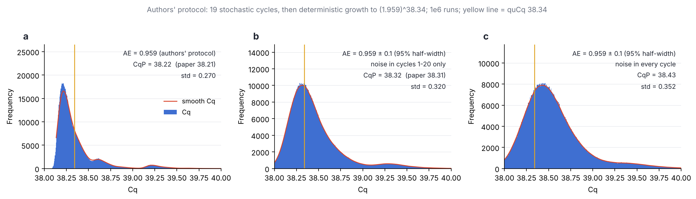

# Cq distribution of a single-molecule PCR branching process

Reproduction of the "four peaks at AE = 0.959, two peaks at AE = 0.959 ± 0.1" claim
(Tang et al., Fig. S3) with a Galton–Watson simulation in Julia, plus a sweep of the
per-cycle efficiency noise σ from 0 to 0.1 and the same experiment at AE = 0.8.

## Model

* `N_0 = 1`. At cycle `n` every particle independently duplicates with probability
  `p_n`, so `N_n = N_{n-1} + Binomial(N_{n-1}, p_n)`.
* Fixed efficiency: `p_n = AE`. Noisy efficiency: `p_n = AE + σ ξ_n`, `ξ_n ~ N(0,1)`,
  one draw per cycle (shared by all particles in that cycle).
* A Gaussian `p_n` can leave `[0,1]`. Two conventions are implemented (`PMODE`):
  `clip` (default, `p -> clamp(p,0,1)`) and `extend` (`p > 1` gives each particle
  `floor(p)` extra copies plus one more with probability `p - floor(p)`, so
  `E[N_n | N_{n-1}] = (1+p_n) N_{n-1}` stays unbiased).
* Stop at the first cycle with `N_n >= 2^38`; Cq is the log-linear interpolation
  `Cq = (n-1) + log(2^38 / N_{n-1}) / log(N_n / N_{n-1})`, so AE = 1 gives Cq = 38 exactly.
* Binomial sampling is exact for `N <= 2^16` (geometric jumps over the rarer outcome,
  cost `O(N min(p,1-p))`) and Gaussian above that. Only the Julia standard library is
  used, so no package installation is needed.

## Files

| file | purpose |
|---|---|
| `sim.jl` | `julia -t auto sim.jl mu sigma nsamples seed out.bin [clip\|extend]` – writes Float64 Cq values |
| `sweep.jl` | `julia -t auto sweep.jl mu sigmax nsteps nsamples seed outdir` – σ sweep in one process |
| `plot_cq.py` | static three-panel figures (σ = 0, σ = 0.1 clip, σ = 0.1 extend) |
| `animate_cq.py` | σ-sweep animation (mp4 + gif) and the filmstrip |
| `paper_protocol.jl` | exact re-implementation of the authors' MATLAB protocol |
| `plot_paper_protocol.py` | plots it with the authors' binning and smoothing |
| `noise_bound.jl` | scans the noise level in that protocol to find when peaks vanish |
| `figures/` | outputs (2×10⁵ runs per static panel, 10⁵ per animation frame) |

Reproduce everything (about 5 minutes on 4 cores):

```sh
J="julia -t auto"; D=data; mkdir -p $D figures
for mu in 0.959 0.8; do
  $J sim.jl $mu 0.0 200000 1 $D/cq_${mu}_0.0.bin
  $J sim.jl $mu 0.1 200000 2 $D/cq_${mu}_0.1.bin
  $J sim.jl $mu 0.1 200000 3 $D/cq_${mu}_0.1_extend.bin extend
  $J sweep.jl $mu 0.1 41 100000 100 $D/sweep_$mu
done
python3 plot_cq.py $D figures
python3 animate_cq.py $D/sweep_0.959 $D/sweep_0.8 figures
```

## Results


**Four peaks at fixed AE = 0.959 are reproduced** (panel a). They are the first few
cycles' discrete outcomes, which are the only stochastic part of the process: once
`N` is large the growth `N -> (1+AE) N` is deterministic, so a single missed
duplication at cycle `k` (one of `2^(k-1)` particles) delays the whole trajectory by

    Δ_k = log2( 2^k / (2^k − 1) ) / log2(1 + AE)

Peak 1 is "no early failure", peaks 2, 3, 4 are one failure at cycle 3, 2, 1:

| | sim. offset | Δ_k (AE = 0.959) | paper (read off Fig. S3a) |
|---|---|---|---|
| peak 2 (k = 3) | +0.20 | 0.199 | ≈ +0.2 |
| peak 3 (k = 2) | +0.43 | 0.428 | ≈ +0.4 |
| peak 4 (k = 1) | +1.03 | 1.031 | ≈ +1.0 |

The weights follow too: peak 4 carries `1 − AE = 4.1 %` of the runs, peak 3 about
`2 AE (1−AE) = 7.9 %`, etc.

**Absolute position.** With threshold `2^38` the main peak sits at Cq ≈ 39.04, not 38.21.
The authors' code uses the threshold `(1.959)^38.34 ≈ 2^37.2` instead (see below), which
accounts for the whole 0.8-cycle offset.

**Noise.** A per-cycle Gaussian `AE ± σ` adds `σ / ((1+AE) ln 2)` to the standard
deviation of `log2 N` per cycle, i.e. a Cq standard deviation of about `4.7 σ` over
the ~39 cycles. That smears the Δ = 0.2 and 0.4 peaks first and the Δ = 1.0 peak last:


* σ ≈ 0.02: peaks 2 and 3 have merged into the shoulder of peak 1, peak 4 survives:
  this is the paper's "two peak" picture (Fig. S3b).
* σ ≈ 0.04–0.06: peak 4 is a shoulder, then gone.
* σ = 0.1 (panels b/c above): a single broad peak, Cq std ≈ 0.5–0.6. With `clip` the
  main peak also shifts late by ≈ 0.7 cycles because 34 % of the draws exceed 1 and are
  clipped (`E[min(p,1)] = 0.936`); with `extend` the shift disappears but the width is
  the same.

A literal per-cycle `N(0.959, 0.1)` is therefore much broader than the paper's
panel b. The authors' code explains why: see the next section.


**AE = 0.8.** Same mechanism, but the early failures are no longer rare
(`1 − AE = 20 %` at cycle 1, `32 %` for exactly one of two at cycle 2), so the
distribution is a broad mixture: the main peak at Cq ≈ 44.4 with peaks 2–4 at
Δ = 0.23, 0.49, 1.18 appearing as shoulders rather than separate peaks, and a
two-failure tail beyond. The intrinsic width (std 0.72) is already larger than the
noise-induced width at σ = 0.1 (total std 0.95), so ± 0.1 only rounds the shape off.

## The authors' exact protocol

Source: `FigS3B_SimSingleDnaRandomE.m`, `FigS3B_GenerateNormalData.m` and
`Fig1D_SimSingleDnaPCR.m` in github.com/Azuresky99/quPCR. It differs from the model
above in three ways:

1. **"± 0.1" is the half-width of a 95 % interval.** `devE = 0.2`, passed as
   `devE/2 = 0.1` with `confidence_level = 0.95`, so `σ = 0.1 / 1.96 = 0.051`.
   The mean is `AE = 0.9593` (the supplement's text says 0.95; the code uses 0.9593).
2. **Noise acts only in the stochastic stage.** Cycles 1–20 are simulated
   (19 binomial doublings, one efficiency draw per tube and per cycle, a molecule replicates
   if `rand <= e_n - 1`, so `p` is clipped to `[0,1]`). After that,
   `Cq = log(T/N_20)/log(1+AE) + 19` with fixed AE, so cycles 21–38 carry no noise.
3. **Threshold `T = (1+AE)^quCq` with `quCq = 38.34`** (38.335 in the S3B script),
   tuned by hand so that the simulated mode lands on the measured CqP = 38.21.

`paper_protocol.jl` re-implements this and reproduces both panels (10⁶ runs each):



| | simulated CqP | paper CqP |
|---|---|---|
| AE = 0.959 | 38.22 | 38.21 |
| AE = 0.959 ± 0.1 (95 %), noise in cycles 1–20 | 38.32 | 38.31 |
| same, noise in every cycle | 38.43 | not in paper |

## What Fig. S3B actually shows: an upper bound on AE noise

S3B tests a single noise level, so it rules out that level, not every level. Scanning
σ in the authors' protocol (`noise_bound.jl`, 3×10⁵ runs per point, 0.15-cycle smoothing
as used for the experimental Fig. 1C) gives the largest per-cycle σ at which each
peak is still a separate local maximum:

| peak (offset from peak 1) | noise in cycles 1–20 only | noise in every cycle |
|---|---|---|
| peak 3 (+0.39) | σ ≈ 0.010 | σ ≈ 0.0075 |
| peak 4 (+1.0)  | above 0.05 | about 0.045 |

Peak 2 is only a shoulder even at σ = 0. Since peak 3 is resolved in the experimental
histogram, the data bound well-independent per-cycle AE fluctuations to σ ≲ 0.01,
i.e. a 95 % range of about ±0.02 around 0.959. The claim that "no physically plausible
degree of efficiency fluctuation" is compatible is stronger than what the figure shows.
The paper's other argument, high-copy Cq SD ≈ 0.03 cycles, gives the same order:
`σ ≲ 0.03 / (0.759 √20) ≈ 0.009`. Both bounds only apply to fluctuations that differ
from well to well. A fluctuation shared by every well on a plate shifts that plate's
whole histogram and does not broaden it.
