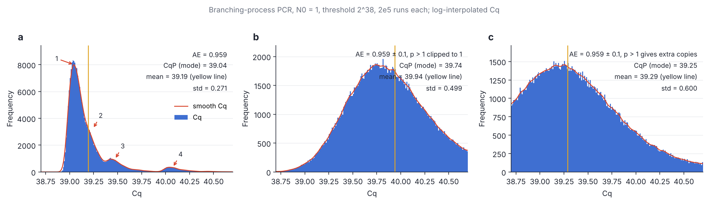
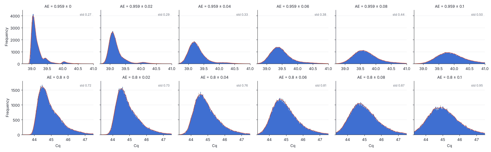
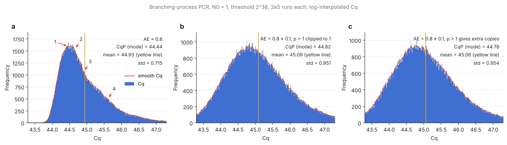

# Cq distribution of a single-molecule PCR branching process

Reproduction of the "four peaks at AE = 0.959, two peaks at AE = 0.959 ± 0.1" claim
(Tang et al., Fig. S3) with a Galton–Watson simulation in Julia, plus a sweep of the
per-cycle efficiency noise σ from 0 to 0.1 and the same experiment at AE = 0.8.

## Model

* `N_0 = 1`. At cycle `n` every particle independently duplicates with probability
  `p_n`, so `N_n = N_{n-1} + Binomial(N_{n-1}, p_n)`.
* Fixed efficiency: `p_n = AE`. Noisy efficiency: `p_n = AE + σ ξ_n`, `ξ_n ~ N(0,1)`,
  one draw per cycle (shared by all particles in that cycle).
* A Gaussian `p_n` can leave `[0,1]`. Two conventions are implemented (`PMODE`):
  `clip` (default, `p -> clamp(p,0,1)`) and `extend` (`p > 1` gives each particle
  `floor(p)` extra copies plus one more with probability `p - floor(p)`, so
  `E[N_n | N_{n-1}] = (1+p_n) N_{n-1}` stays unbiased).
* Stop at the first cycle with `N_n >= 2^38`; Cq is the log-linear interpolation
  `Cq = (n-1) + log(2^38 / N_{n-1}) / log(N_n / N_{n-1})`, so AE = 1 gives Cq = 38 exactly.
* Binomial sampling is exact for `N <= 2^16` (geometric jumps over the rarer outcome,
  cost `O(N min(p,1-p))`) and Gaussian above that. Only the Julia standard library is
  used, so no package installation is needed.

## Files

| file | purpose |
|---|---|
| `sim.jl` | `julia -t auto sim.jl mu sigma nsamples seed out.bin [clip\|extend]` – writes Float64 Cq values |
| `sweep.jl` | `julia -t auto sweep.jl mu sigmax nsteps nsamples seed outdir` – σ sweep in one process |
| `plot_cq.py` | static three-panel figures (σ = 0, σ = 0.1 clip, σ = 0.1 extend) |
| `animate_cq.py` | σ-sweep animation (mp4 + gif) and the filmstrip |
| `figures/` | outputs (2×10⁵ runs per static panel, 10⁵ per animation frame) |

Reproduce everything (about 5 minutes on 4 cores):

```sh
J="julia -t auto"; D=data; mkdir -p $D figures
for mu in 0.959 0.8; do
  $J sim.jl $mu 0.0 200000 1 $D/cq_${mu}_0.0.bin
  $J sim.jl $mu 0.1 200000 2 $D/cq_${mu}_0.1.bin
  $J sim.jl $mu 0.1 200000 3 $D/cq_${mu}_0.1_extend.bin extend
  $J sweep.jl $mu 0.1 41 100000 100 $D/sweep_$mu
done
python3 plot_cq.py $D figures
python3 animate_cq.py $D/sweep_0.959 $D/sweep_0.8 figures
```

## Results



**Four peaks at fixed AE = 0.959 are reproduced** (panel a). They are the first few
cycles' discrete outcomes, which are the only stochastic part of the process: once
`N` is large the growth `N -> (1+AE) N` is deterministic, so a single missed
duplication at cycle `k` (one of `2^(k-1)` particles) delays the whole trajectory by

    Δ_k = log2( 2^k / (2^k − 1) ) / log2(1 + AE)

Peak 1 is "no early failure", peaks 2, 3, 4 are one failure at cycle 3, 2, 1:

| | sim. offset | Δ_k (AE = 0.959) | paper (read off Fig. S3a) |
|---|---|---|---|
| peak 2 (k = 3) | +0.20 | 0.199 | ≈ +0.2 |
| peak 3 (k = 2) | +0.43 | 0.428 | ≈ +0.4 |
| peak 4 (k = 1) | +1.03 | 1.031 | ≈ +1.0 |

The weights follow too: peak 4 carries `1 − AE = 4.1 %` of the runs, peak 3 about
`2 AE (1−AE) = 7.9 %`, etc.

**Absolute position does not match.** With `N_0 = 1`, threshold `2^38` and this
Cq definition the main peak sits at Cq ≈ 39.04 (mean 39.19), not 38.21. The
deterministic estimate is `38 / log2(1.959) = 39.17`, so 38.21 would need either a
threshold near `2^37.1` or a different cycle-counting convention in the paper; the
peak spacings are insensitive to this, the offset is not.

**Noise.** A per-cycle Gaussian `AE ± σ` adds `σ / ((1+AE) ln 2)` to the standard
deviation of `log2 N` per cycle, i.e. a Cq standard deviation of about `4.7 σ` over
the ~39 cycles. That smears the Δ = 0.2 and 0.4 peaks first and the Δ = 1.0 peak last:



* σ ≈ 0.02: peaks 2 and 3 have merged into the shoulder of peak 1, peak 4 survives:
  this is the paper's "two peak" picture (Fig. S3b).
* σ ≈ 0.04–0.06: peak 4 is a shoulder, then gone.
* σ = 0.1 (panels b/c above): a single broad peak, Cq std ≈ 0.5–0.6. With `clip` the
  main peak also shifts late by ≈ 0.7 cycles because 34 % of the draws exceed 1 and are
  clipped (`E[min(p,1)] = 0.936`); with `extend` the shift disappears but the width is
  the same.

So the paper's panel b (main peak barely shifted, std ≈ 0.15, a distinct bump one cycle
later) corresponds to an effective per-cycle σ of about 0.02–0.03, not 0.1: a literal
`N(0.959, 0.1)` per cycle overshoots it by a factor of ~4 in width. Either their "± 0.1"
is not a one-sigma per-cycle Gaussian, or the noise is applied differently. The
animation `figures/cq_sigma_sweep.gif` / `.mp4` sweeps σ from 0 to 0.1 in steps of
0.0025.



**AE = 0.8.** Same mechanism, but the early failures are no longer rare
(`1 − AE = 20 %` at cycle 1, `32 %` for exactly one of two at cycle 2), so the
distribution is a broad mixture: the main peak at Cq ≈ 44.4 with peaks 2–4 at
Δ = 0.23, 0.49, 1.18 appearing as shoulders rather than separate peaks, and a
two-failure tail beyond. The intrinsic width (std 0.72) is already larger than the
noise-induced width at σ = 0.1 (total std 0.95), so ± 0.1 only rounds the shape off.
